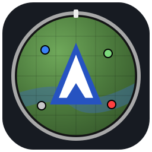

<div style="text-align: center">
  
</div>

# Shared Journey

**One world, one map — shared by everyone.**

Shared Journey is a **server-authoritative** mapping mod for Minecraft **1.21.1** (NeoForge, Java 21).
The server renders, owns, and distributes the map; clients simply display what the server pushes.
Every player sees the exact same explored world, including what was explored by others — the map
becomes a collective achievement instead of a per-player minimap dump.

> ## ⚠️ Support policy — read before opening an issue
>
> Shared Journey is a **hobby project**, maintained on free time and provided **as-is**.
>
> - Issues and feature requests are welcome and will be read — and handled **if and when**
>   time and motivation allow.
> - There is **no guaranteed response time, no roadmap, and no promise** that a report leads
>   to a fix or that a request leads to a feature.
> - Maintaining this mod is **not my job**. Using it creates **no obligation and no
>   accountability** on my part toward users.
> - It is open source: the most effective way to get something changed is a well-scoped
>   **pull request**, reviewed under the same terms — see the
>   [contribution guidelines](CONTRIBUTING.md).

---

## Why server-authoritative?

Classic mapping mods compute the map on each client, which makes them blind to what teammates
explored and trivially abusable (radar and cave views reveal things the player never saw).
Shared Journey flips the model:

- **The server is the single source of truth.** Chunks are rendered server-side into 512×512
  PNG regions and streamed to clients through a delta sync with a per-player bandwidth cap.
- **Everyone shares the same map.** New players joining an established server instantly
  receive everything the community has already explored.
- **Anti-cheat by design.** The entity radar radius is capped by the server; cave layers are
  only painted where a player has actually been underground; the fullscreen map's hover data
  is precomputed server-side, so the client never loads chunks on demand (no timing attacks).

## Features

### Shared world map
- Five layers rendered server-side: **Day**, **Night**, **Topographic**, **Biome**, and
  **Cave** (with vertical bands every 16 blocks).
- JourneyMap-like colors derived from the actual block **textures** — including **modded
  blocks**, whose colors are extracted automatically from their mod jars at runtime, with
  per-block config overrides when needed.
- The map lives inside the world save (`world/data/sharedjourney/`), so it is part of your
  regular backups. Clients keep a per-server disk cache to avoid re-downloading.

### Minimap
- Round or square, optional **dynamic rotation**, keyboard zoom, cardinal points, and
  time / biome / coordinates labels.
- **Entity radar** with per-category filters (players, hostiles, passives, pets, villagers)
  and a **server-enforced radius cap**.
- Mobs are drawn as **flat head icons rendered live from their own entity model** — no
  hardcoded sprite set, so modded mobs work out of the box. Other players appear as their
  skin face.

### Fullscreen map (`M`)
- Mouse pan, wheel zoom, layer and cave-band switching, position search, follow-me mode —
  and click a **Create train** to smoothly follow it across the network.
- **Hover info**: height, surface block, and biome under the cursor — fully client-local.
- Right-click **context menu**: waypoints (private, temporary, or public), teleport (OP),
  and sharing the position in chat — the chat input is pre-filled with `[x, z]` (JourneyMap
  style) so you can add context before sending; received coordinates become clickable links
  that open the map there.
- Works while the chat is open, and can be opened centered anywhere via clickable chat
  messages (`/sj goto`).

### Waypoints
- Personal waypoints with **server synchronization** (they follow you across machines),
  plus **public waypoints** shared with the whole server.
- **Banner waypoints**: place a *named* banner and it becomes a map marker; break it and the
  marker disappears — vanilla-style, no GUI required.
- Automatic **death waypoints**, a waypoint list screen (`U`), quick creation (`B`), and
  full editing (name, color, visibility) from the map.

### Mod compatibility
- **JourneyMap plugin bridge**: mods that integrate with JourneyMap's client API (Waystones,
  Create add-ons, resource-deposit mods…) work without JourneyMap installed. Shared Journey
  scans for JourneyMap plugins and feeds them a runtime proxy — zero compile-time
  dependency: their waypoints land in the waypoint store and their overlays (rails, trains,
  deposits…) render on both the minimap and the fullscreen map. An optional companion jar
  (`jmshim`) declares the `journeymap` mod id for mods that check `ModList` before enabling
  their integration (never install it alongside the real JourneyMap).
- Modded **blocks** get map colors automatically (texture extraction); modded **mobs** get
  radar icons automatically (model-based rendering).
- A public API for other mods: waypoint CRUD + cancellable events, map render events for
  custom overlays (minimap and fullscreen), and a custom layer registration hook.

### Performance
- Fully **asynchronous render engine**: the server tick only resolves chunks; pixel work,
  PNG encoding, and disk I/O happen on worker threads with an in-flight cap.
- **Delta sync**: only regions newer than what the client already has are sent, batched
  under a configurable KB/s per-player budget.

## Screenshots

<!-- See docs/images/README.md for the full shot list and capture guidelines. -->

|                                                                     |                                                                       |
|---------------------------------------------------------------------|-----------------------------------------------------------------------|
|          |            |
| Round minimap — radar, mob head icons, time/biome/coords labels     | Dynamic rotation mode                                                 |
|  |  |
| Right-click context menu                                            | Waypoints, including a banner waypoint                                |
|                            |                 |
| Cave layer (anti-exploit unlocking)                                 | Waypoint list screen                                                  |

## Controls (rebindable)

| Key       | Action                             |
|-----------|------------------------------------|
| `M`       | Open the fullscreen map            |
| `N`       | Toggle the minimap                 |
| `,`       | Cycle map layer                    |
| `+` / `-` | Minimap zoom                       |
| `U`       | Waypoint list                      |
| `B`       | Create a waypoint at your position |

## Commands

Root: `/sj` (alias `/sharedjourney`).

| Command                                       | Side   | Permission                                         |
|-----------------------------------------------|--------|----------------------------------------------------|
| `/sj stats [player]`                          | server | everyone (own stats) / OP (engine + everyone)      |
| `/sj tp <x> <z>`                              | server | OP — teleport from the map, Y resolved server-side |
| `/sj purge <layer\|all>`                      | client | — deletes the local cache of a layer               |
| `/sj cache`                                   | client | — local cache status                               |
| `/sj goto <x> <z>`                            | client | — opens the map centered on a position             |
| `/sj admin sync force <players\|all> [rx rz]` | server | OP — forced resend, ignores the index              |
| `/sj admin rerender <chunkRadius>`            | server | OP — re-render around you                          |
| `/sj admin regen full` / `cancel`             | server | OP — full map regeneration                         |
| `/sj admin layer <dim> <layer> <bool>`        | server | OP — toggle layers per dimension, hot              |
| `/sj admin save`                              | server | OP — flush to disk                                 |

## Configuration

Standard NeoForge three-tier configuration, editable in-game (config screen) with hot reload:

- **Client** (`config/sharedjourney-client.toml`): minimap shape/position/rotation, radar
  filters and mob head icons, waypoint display, map behavior.
- **Common** (`config/sharedjourney-common.toml`).
- **Server**: defaults in `defaultconfigs/sharedjourney-server.toml`, overridable per world
  in `world/serverconfig/sharedjourney-server.toml` — engine threads, sync rate and
  bandwidth caps, active layers, radar radius cap, waypoint rules, block color overrides.

## Building from source

Requirements: JDK 21. Then:

```bash
./gradlew build               # mod jar → build/libs/
./gradlew runClient_1         # dev client (a second one: runClient_2)
./gradlew runServer           # dedicated dev server
./gradlew :jmshim:build       # optional JourneyMap shim jar
```

Codebase architecture and conventions are documented in [CLAUDE.md](CLAUDE.md).

## License

[MIT](LICENSE) — do whatever you want with it, including forking and redistributing;
just keep the copyright notice.

## Known limitations

- Custom layers registered through the API are collected, but their storage/sync pipeline
  is not wired yet — the five built-in layers are fully operational.
- The JourneyMap bridge covers waypoints and the overlay types used by common integrations;
  exotic API surfaces (themes, mapping events…) are acknowledged and ignored.
- World edits from pistons/fluids/explosions are partially covered: affected chunks refresh
  on their next dirty-marking or load.
